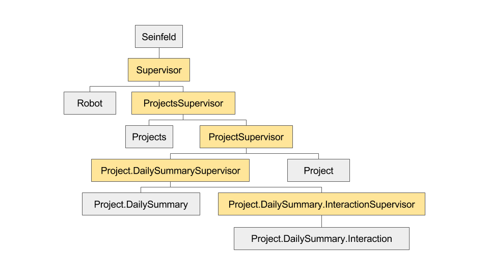

# Seinfeld - A Standup Application for Hedwig

Seinfeld is an application for managing standups on your teams.  Right now the
focus is on having it interact with your team via Hedwig and Chat, but at heart
it's just an OTP application that happens to support Hedwig and Chat interfaces
as its initial use case.

You tell it what projects you have and who's on the team, and it will contact
them daily (on workdays) to ask them the Sacrosanct Standup Questions so you can
be, I don't know, Agile or something.  It'll also keep track of the historical
answers to those question for reporting, or accountability, or mockery purposes.

NOTE: For now there's no storage of the data once the application shuts down.
Once this is all working, we'll add support for storing state in PostgreSQL via
[moebius](https://github.com/robconery/moebius).

## Usage

You can just configure `hedwig` to connect to your Slack installation:

```elixir
config :seinfeld, Seinfeld.Robot,
  adapter: Hedwig.Adapters.Slack,
  name: "seinfeld",
  aka: "/",
  token: System.get_env("SLACK_API_TOKEN"),
  responders: [
    {Seinfeld.Responders.Chat, []},
  ]
```

From there, it will connect to your Slack installation.  You can then invite it
into any of your project rooms so that it can send summaries to the room.

### Interacting via chat

If you're interacting with your bot from a chat interface, you can use it as
follows:

#### Project setup

```
> knewter: @seinfeld help
> seinfeld: - @seinfeld list projects - List all of the projects I know about
            - @seinfeld add project <name> <channel> - Teach me about a new project, and where I should send updates
            - @seinfeld add user <project_name> <user_name> - Tell me to add user_name to project_name
            - @seinfeld users <project_name> - Ask me what users are on project_name
            - @seinfeld set questions <project_name> <semicolon_separated_questions> - Tell me the list of questions you want me to ask for project_name.  Separate them with a semicolon.
            - @seinfeld start standup <project_name> - Ask me to start asking the standup questions for project_name to each of its users.  They'll have an hour to answer them, and I'll summarize the answers into the project's channel once everyone's answered or the hour has passed.
```

#### Imaginary Bot Conversation

When it's time for you to answer the project's standup questions, seinfeld will
send you a private message.

```
> seinfeld: Hey @knewter, ready for standup?
> knewter: yes
> seinfeld: What did you do yesterday?
> knewter: Ate pasta.
> seinfeld: What are you doing today? (NOTE: If you would like to fix the last answer, say "mulligan")
> knewter: mulligan
> seinfeld: Got it.  What did you do yesterday?
> knewter: Ate pizza
> seinfeld: What are you doing today? (NOTE: If you would like to fix the last answer, say "mulligan")
> knewter: Recovering
> seinfeld: Any blockers? (NOTE: If you would like to fix the last answer, say "mulligan")
> knewter: Colon
> seinfeld: Got it.  Here's your answers:
            ... (repeat it)
            Are we good?
> knewter: no
> seinfeld: We'll start over...
(repeat)
```

## Details

As it's just an OTP application, we'll start off explaining how its supervision
tree is laid out.

### Supervision Tree

Here's the application's Supervision Tree:



- Seinfeld - The Application (standups.  get it?)
  - Seinfeld.Supervisor - The primary supervisor
    - Seinfeld.ProjectsSupervisor - The supervisor for projects
      - Seinfeld.Projects - The GenServer that manages all of the projects we're handling standups for.
      - Seinfeld.ProjectSupervisor - A supervisor for a given project
        - Seinfeld.Project.DailySummarySupervisor - The supervisor for a given
          project's daily summary process.  Just guarantees that it stays up.
          - Seinfeld.Project.DailySummary - A GenServer that manages the interactions with each team member for the given questions.
          - Seinfeld.Project.DailySummary.InteractionSupervisor - The supervisor for managing a given interaction with a team member.
            - Seinfeld.Project.DailySummary.Interaction - A GenServer that manages the interaction with a given team member for a given DailySummary.
        - Seinfeld.Project - A GenServer that manages a given project.
    - Seinfeld.Robot - A Hedwig Robot manages sending the messages in to a given channel.  NOTE: He needs to be invited into the rooms for each project.

### Interface

Here's what various bits of Elixir code look like, re: interacting with
Seinfeld's various systems.  Some of these functions would only really be called
from within a subcomponent, but this is the session we went through to design
the API.

```elixir
alias Seinfeld.{Project, ProjectServer, ProjectsServer, Project.DailySummaries, Robot}

# Add a project
false = Projects.exists?("elixirsips")
## Arguments: project_name, channel_name
{:ok, project_pid} = Projects.add("elixirsips", "elixirsips")
^project_pid = Projects.whereis("elixirsips")
true = Projects.exists?("elixirsips")
[] = Project.users(project_pid)
:ok = Project.add_user(project_pid, "knewter")
:ok = Project.add_user(project_pid, "scrogson")
["knewter", "scrogson"] = Project.users(project_pid)
[] = Project.questions(project_pid)
:ok = Project.set_questions(project_pid, ["What did you do yesterday?", "What are you doing today?", "Any blockers?"])
["What did you do yesterday?", "What are you doing today?", "Any blockers?"] = Project.questions(project_pid)
date = {2016, 04, 21}
false = Project.DailySummaries.whereis?(date)
# Expect this to happen on a timer and for it to manage interacting with the users
# He'll make a new GenServer for each user that kills itself after a
# predetermined timeout.
{:ok, daily_summary_pid} = Project.DailySummaries.add(date) # Do we just monitor here and not link?
# Some time passes...
# This happens from a given user's DailySummaryUserManager right before it kills [terrible name]
# itself.  I want them to be restarted if they crash but I want them to be able
# to kill themselves as well.  Have to figure that out.
:ok = Project.DailySummary.submit_answers(daily_summary_pid, "knewter", [
  {"What did you do yesterday?", "Ate pizza.  Too much."},
  {"What are you doing today?", "Recovering"},
  {"Any blockers?", "Colon"}
])
%DailySummary{
  date: {2016, 04, 21},
  questions: [
    # A list of questions and each user's response.
    {"What did you do yesterday?", %{"knewter" => "Ate pizza.  Too much."}},
    {"What are you doing today?", %{"knewter" => "Recovering"}},
    {"Any blockers?", %{"knewter" => "Colon"}}
  ]
}
# scrogson answers one question then peaces out.  After an hour, the
# DailySummaryUserManager 'finish' timer fires and he submits these answers.
:ok = Project.DailySummary.submit_answers(daily_summary_pid, "scrogson", [
  {"What did you do yesterday?", "Nothing"}
  {"What are you doing today?", :unanswered},
  {"Any blockers?", :unanswered}
])
# When the DailySummary is completed it will call into Project to update its state like so.  This happens from inside the DailySummary GenServer
state.summary # looks like, from inside Project.DailySummary server:
%DailySummary{
  date: {2016, 04, 21},
  questions: [
    # A list of questions and each user's response.
    {"What did you do yesterday?", %{"knewter" => "Ate pizza.  Too much.", "scrogson" => "Nothing"}},
    {"What are you doing today?", %{"knewter" => "Recovering", "scrogson" => :unanswered}},
    {"Any blockers?", %{"knewter" => "Colon", "scrogson" => :unanswered}}
  ]
}
:ok = Project.store_summary(state.summary)

Project.get_summary(project_pid, date)
# will look like
%DailySummary{
  date: {2016, 04, 21},
  questions: [
    # A list of questions and each user's response.
    {"What did you do yesterday?", %{"knewter" => "Ate pizza.  Too much.", "scrogson" => :unanswered}},
    {"What are you doing today?", %{"knewter" => "Recovering", "scrogson" => "Laughing at knewter"}},
    {"Any blockers?", %{"knewter" => "Colon", "scrogson" => :unanswered}}
  ]
}
```

## Installation

If [available in Hex](https://hex.pm/docs/publish), the package can be installed as:

  1. Add `seinfeld` to your list of dependencies in `mix.exs`:

    ```elixir
    def deps do
      [{:seinfeld, "~> 0.0.1"}]
    end
    ```

  2. Ensure `seinfeld` is started before your application:

    ```elixir
    def application do
      [applications: [:seinfeld]]
    end
    ```

